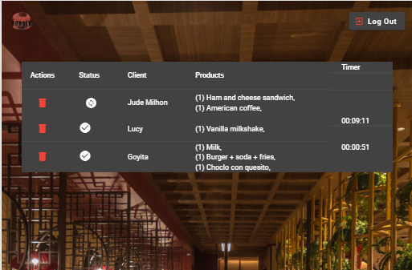

# BURGUER 1997 

## Índice

* [1. Preámbulo](#1-preámbulo)
* [2. Resumen del proyecto](#2-resumen-del-proyecto)
* [3. Herramientas](#3-herramientas)
* [4. Historias de usuario](#4-historias-de-usuario)
* [5. Prototipos](#5-prototipos)
* [6. Planificación del proyecto](#6-planificacion-del-proyecto)
* [7. Resultado](#7-resultado)
***

## 1. Preámbulo

El objetivo del proyecto fue crear una  página web destinada a un restaurante, una SPA, que tendrá accessos de administrador, mesero y cocinero, las funcionalidades varian desde la creación de ordenes, visualización de ordenes listas para ser entregadas, hasta la vista del cocinero que puede marcar cuando una orden esta lista y ver el tiempo que le demoró, para el amdinistrador se desarrolló funcionalidades para que pueda crear, editar y eliminar productos y usuarios, solo adentrate en esta aplicación desarrollada desde Burguer 1997.

Ver la página: [Burger1997](https://burger1997.netlify.app/login)
## 2. Resumen del proyecto

La tematica elegida fue pensada para resolver los constantes retos de acceso de información instantanea que existen en un restaurante.

1.- Los principlaes usuarios del producto son administradores meseros y cocineros.

2.- Los objetivos de los usuarios en relacion con el producto son según su rol, obtener información inmediata para la correcta atención al cliente.

## 3. Herramientas

Los lenguajes utilizados fueron HTML, CSS y JavaScript, se uso el framework de Angular, la libreria Angular Material. Se crearon e implementaron test unitarios con Jasmine y Karma que junto a los tests de integración de componentes superó el 90%

## 4. Historias de Usuario

#### [Historia de usuario 1] Mesero/a debe poder ingresar al sistema, si el admin ya le ha asignado credenciales

Yo como meserx quiero poder ingresar al sistema de pedidos.

##### Criterios de aceptación

Lo que debe ocurrir para que se satisfagan las necesidades del usuario.

* Acceder a una pantalla de login.
* Ingresar email y contraseña.
* Recibir mensajes de error comprensibles, dependiendo de cuál es el error
  con la información ingresada.
* Ingresar al sistema de pedidos si las crendenciales son correctas.

##### Definición de terminado

Lo acordado que debe ocurrir para decir que la historia está terminada.

* Debes haber recibido _code review_ de al menos una compañera.
* Haces _test_ unitarios y, además, has testeado tu producto manualmente.
* Hiciste _tests_ de usabilidad e incorporaste el _feedback_ del usuario.
* Desplegaste tu aplicación y has etiquetado tu versión (git tag).

***

#### [Historia de usuario 2] Mesero/a debe poder tomar pedido de cliente/a

Yo como meserx quiero tomar el pedido de unx clientx para no depender de mi mala
memoria, para saber cuánto cobrar, y enviarlo a la cocina para evitar errores y
que se puedan ir preparando en orden.

##### Criterios de aceptación

Lo que debe ocurrir para que se satisfagan las necesidades del usuario

* Anotar nombre de clientx.
* Agregar productos al pedido.
* Eliminar productos.
* Ver resumen y el total de la compra.
* Enviar pedido a cocina (guardar en alguna base de datos).
* Se ve y funciona bien en una _tablet_

##### Definición de terminado

Lo acordado que debe ocurrir para decir que la historia está terminada.

* Debes haber recibido _code review_ de al menos una compañera.
* Haces _test_ unitarios y, además, has testeado tu producto manualmente.
* Hiciste _tests_ de usabilidad e incorporaste el _feedback_ del usuario.
* Desplegaste tu aplicación y has etiquetado tu versión (git tag).

***

#### [Historia de usuario 3] Jefe de cocina debe ver los pedidos

Yo como jefx de cocina quiero ver los pedidos de lxs clientxs en orden y
marcar cuáles están listos para saber qué se debe cocinar y avisar a lxs meserxs
que un pedido está listo para servirlo a un clientx.

##### Criterios de aceptación

* Ver los pedidos ordenados según se van haciendo.
* Marcar los pedidos que se han preparado y están listos para servirse.
* Ver el tiempo que tomó prepara el pedido desde que llegó hasta que se
  marcó como completado.

##### Definición de terminado

* Debes haber recibido _code review_ de al menos una compañera.
* Haces _test_ unitarios y, además, has testeado tu producto manualmente.
* Hiciste _tests_ de usabilidad e incorporaste el _feedback_ del usuario.
* Desplegaste tu aplicación y has etiquetado tu versión (git tag).

***

#### [Historia de usuario 4] Meserx debe ver pedidos listos para servir

Yo como meserx quiero ver los pedidos que están preparados para entregarlos
rápidamente a lxs clientxs que las hicieron.

##### Criterios de aceptación

* Ver listado de pedido listos para servir.
* Marcar pedidos que han sido entregados.

##### Definición de terminado

* Debes haber recibido _code review_ de al menos una compañera.
* Haces _test_ unitarios y, además, has testeado tu producto manualmente.
* Hiciste _tests_ de usabilidad e incorporaste el _feedback_ del usuario.
* Desplegaste tu aplicación y has etiquetado tu versión (git tag).
* Los datos se deben mantener íntegros, incluso después de que un pedido ha
  terminado. Todo esto para poder tener estadísticas en el futuro.

***

#### [Historia de usuario 5] Administrador(a) de tienda debe administrar a sus trabajadorxs

Yo como administrador(a) de tienda quiero gestionar a los usuarios de
la plataforma para mantener actualizado la informacion de mis trabajadorxs.

##### Criterios de aceptación

* Ver listado de trabajadorxs.
* Agregar trabajadorxs.
* Eliminar trabajadoxs.
* Actualizar datos de trabajadorxs.

##### Definición de terminado

* Debes haber recibido _code review_ de al menos una compañera.
* Haces _test_ unitarios y, además, has testeado tu producto manualmente.
* Hiciste _tests_ de usabilidad e incorporaste el _feedback_ del usuario.
* Desplegaste tu aplicación y has etiquetado tu versión (git tag).

***

#### [Historia de usuario 6] Administrador(a) de tienda debe administrar a sus productos

Yo como administrador(a) de tienda quiero gestionar los productos
para mantener actualizado el menú.

##### Criterios de aceptación

* Ver listado de productos.
* Agregar productos.
* Eliminar productos.
* Actualizar datos de productos.

##### Definición de terminado

* Debes haber recibido _code review_ de al menos una compañera.
* Haces _test_ unitarios y, además, has testeado tu producto manualmente.
* Hiciste _tests_ de usabilidad e incorporaste el _feedback_ del usuario.
* Desplegaste tu aplicación y has etiquetado tu versión (git tag).

***

## 5. Prototipos
Se trabajo en la elaboración de un prototipo de alta fidelidad el cual fue evaluado por nuestras compañeras de las cuales recibi feedback para posteriormente y después de aplicar las sugerencias , volver a solicitarles ayuda en el test de usabilidad. El feedback dado fue el siguiente:
* Me gusta la imagen de fondo, pero el logo se pierde un poco el número, no sé si colocandolo arriba mejore.
* Creo que el botón de historial de pedidos se vea en la vista de mesero no en la principal para tener seguridad de quién ve los pedidos
* Me parece intuitivo con respecto a la historia de usuario dada.
* Me gusta la paleta de colores y la distribución de los productos y la oder de pedido. Es muy explícita.
* Me parece bien la distribución de los elementos
* Me gusto la paleta de  colores
* El logo es increíble
* Añadele una confirmación de eliminación, puede que por accidente aprienten el boton delete.

#### Prototipos de alta fidelidad

 Prototipo dinámico: [Prototipo dinamico](https://www.figma.com/proto/sKL7mQx1XwclUYnEBqdQIA/burguer-1997?node-id=1-2&starting-point-node-id=1%3A2&mode=design&t=10Pz76zp8YFJmXgj-1)

Use para el diseño del protipo [Figma](https://www.figma.com/) 
### Testing

El proyecto cuenta con test para los componentes que incluyen login, orders,kitchen, readyOrders y Admin ,también se testeo el redireccionamiento de botones a las rutas correspondientes.

## 6. Planificación del proyecto

Me planifiqué en Git Hub projects, este me ayudo a optimizar mi proceso y hacerle seguimiento a mi avance diario.

## 7. Resultado

